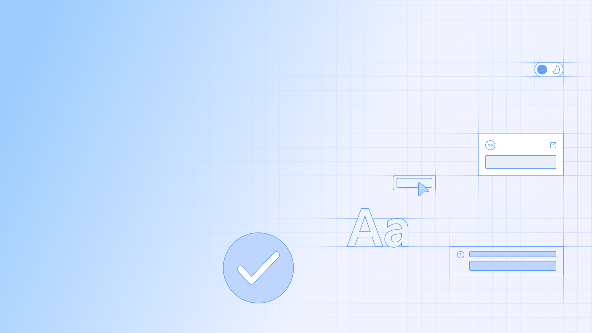

<Main>

# My First Guidelines

Published 3/7/2024

---

Lorem ipsum dolor sit amet, consectetur adipiscing elit, sed do eiusmod tempor [incididunt](/) ut labore et dolore magna aliqua. In ornare quam viverra orci sagittis eu volutpat odio facilisis. Lacinia at quis risus sed vulputate odio ut enim blandit. Nulla aliquet enim tortor at auctor urna nunc. Suspendisse interdum consectetur libero id faucibus. Pharetra et ultrices neque ornare aenean euismod. Pharetra et ultrices neque ornare. Nibh tortor id aliquet lectus proin nibh nisl condimentum id. Iaculis nunc sed augue lacus viverra vitae congue. Vel elit scelerisque mauris pellentesque pulvinar pellentesque habitant morbi tristique.

Turpis nunc eget lorem dolor sed viverra ipsum. Nisi lacus sed viverra tellus in hac habitasse. Penatibus et magnis dis parturient montes. Arcu non odio euismod lacinia at quis risus. Feugiat nibh sed pulvinar proin gravida hendrerit lectus. Erat velit scelerisque in dictum non consectetur a erat. Volutpat consequat mauris nunc congue. Ultrices gravida dictum fusce ut placerat orci nulla pellentesque. Nunc id cursus metus aliquam eleifend mi in. Lacus luctus accumsan tortor posuere ac ut consequat. Enim praesent elementum facilisis leo vel fringilla est ullamcorper.

Purus non enim praesent elementum facilisis leo vel fringilla. Turpis massa sed elementum tempus egestas sed sed. Commodo nulla facilisi nullam vehicula ipsum a. Scelerisque purus semper eget duis at tellus. Et netus et malesuada fames ac turpis egestas sed. Aliquet porttitor lacus luctus accumsan tortor posuere ac ut. Mattis ullamcorper velit sed ullamcorper. Lorem sed risus ultricies tristique nulla aliquet enim. Ullamcorper dignissim cras tincidunt lobortis. Venenatis cras sed felis eget. Facilisi cras fermentum odio eu feugiat pretium nibh ipsum. Nibh tortor id aliquet lectus proin nibh. Fringilla urna porttitor rhoncus dolor purus non enim. Amet consectetur adipiscing elit pellentesque habitant morbi tristique senectus.

## Examples

<Grid variant="two-columns">
  <Grid as="figure">
    
    <figcaption>
      <Text block variant="caption">Guidance topic 1</Text>
      <Text block>Write the guidance for this topic. Be brief, 3-4 sentences is ideal. Make sure that the guidance is targeted and actionable.</Text>
    </figcaption>
  </Grid>
  <Grid as="figure">
    
    <figcaption>
      <Text block variant="caption">Guidance topic 2</Text>
      <Text block>Write the guidance for this topic. Be brief, 3-4 sentences is ideal. Make sure that the guidance is targeted and actionable.</Text>
    </figcaption>
  </Grid>
  <Grid as="figure">
    
    <figcaption>
      <Text block variant="caption">Guidance topic 3</Text>
      <Text block>Write the guidance for this topic. Be brief, 3-4 sentences is ideal. Make sure that the guidance is targeted and actionable.</Text>
    </figcaption>
  </Grid>
  <Grid as="figure">
    
    <figcaption>
      <Text block variant="caption">Guidance topic 4</Text>
      <Text block>Write the guidance for this topic. Be brief, 3-4 sentences is ideal. Make sure that the guidance is targeted and actionable.</Text>
    </figcaption>
  </Grid>
</Grid>

## Principles

Rutrum quisque non tellus orci ac auctor augue mauris augue. Ornare arcu odio ut sem nulla pharetra. Lectus vestibulum mattis ullamcorper velit sed ullamcorper morbi tincidunt ornare. Non enim praesent elementum facilisis leo. Pellentesque massa placerat duis ultricies lacus. Orci phasellus egestas tellus rutrum tellus pellentesque eu tincidunt. Sit amet consectetur adipiscing elit pellentesque habitant. Scelerisque fermentum dui faucibus in ornare quam viverra. Fermentum et sollicitudin ac orci phasellus egestas tellus. Hendrerit dolor magna eget est. Viverra ipsum nunc aliquet bibendum enim facilisis gravida neque. Tortor dignissim convallis aenean et tortor. Urna neque viverra justo nec ultrices dui. Semper eget duis at tellus at urna condimentum mattis.

<BookmarkTile
  title="Principles Document"
  description="View this document for the latest updates in our strategy and vision."
  isExternal={true}
  to="www.example.com"
/>

## Usage: Dos and Don’ts

<Grid variant="two-columns">
  <RecommendationTile
    title="Correct"
    recommendation="positive"
    recommendationsList={[
      "Point 1. Nisi lacus sed viverra tellus in hac habitasse.",
      "Point 2. Penatibus et magnis dis parturient montes. Arcu non odio euismod lacinia at quis risus. Feugiat nibh sed pulvinar proin gravida hendrerit lectus. Erat velit scelerisque in dictum non consectetur a erat. Volutpat consequat mauris nunc congue. Ultrices gravida dictum fusce ut placerat orci nulla pellentesque. Nunc id cursus metus aliquam eleifend mi in. Lacus luctus accumsan tortor posuere ac ut consequat.",
      "Point 3. Enim praesent elementum facilisis leo vel fringilla est ullamcorper."
    ]}
  />
  <RecommendationTile
    title="Incorrect"
    recommendation="negative"
    recommendationsList={[
      "Point 1. Nisi lacus sed viverra tellus in hac habitasse.",
      "Point 2. Penatibus et magnis dis parturient montes. Arcu non odio euismod lacinia at quis risus.",
      "Point 3. Enim praesent elementum facilisis leo vel fringilla est ullamcorper."
    ]}
  />
</Grid>

## Who can see this guide?

Lorem ipsum dolor sit amet, consectetur adipiscing elit, sed do eiusmod tempor [incididunt](/) ut labore et dolore magna aliqua. In ornare quam viverra orci sagittis eu volutpat odio facilisis. Lacinia at quis risus sed vulputate odio ut enim blandit. Nulla aliquet enim tortor at auctor urna nunc. Suspendisse interdum consectetur libero id faucibus. Pharetra et ultrices neque ornare aenean euismod. Pharetra et ultrices neque ornare. Nibh tortor id aliquet lectus proin nibh nisl condimentum id. Iaculis nunc sed augue lacus viverra vitae congue. Vel elit scelerisque mauris pellentesque pulvinar pellentesque habitant morbi tristique.

Turpis nunc eget lorem dolor sed viverra ipsum. Nisi lacus sed viverra tellus in hac habitasse. Penatibus et magnis.

## How to create?

### Definiting experience

Read this document on how to create hour own components.

### Meadows and valleys

Lorem ipsum dolor sit amet, consectetur adipiscing elit, sed do eiusmod tempor [incididunt](/) ut labore et dolore magna aliqua. In ornare quam viverra orci sagittis eu volutpat odio facilisis. Lacinia at quis risus sed vulputate odio ut enim blandit. Nulla aliquet enim tortor at auctor urna nunc. Suspendisse interdum consectetur libero id faucibus. Pharetra et ultrices neque ornare aenean euismod. Pharetra et ultrices neque ornare. Nibh tortor id aliquet lectus proin nibh nisl condimentum id. Iaculis nunc sed augue lacus viverra vitae congue. Vel elit scelerisque mauris pellentesque pulvinar pellentesque habitant morbi tristique.

Turpis nunc eget lorem dolor sed viverra ipsum. Nisi lacus sed viverra tellus in hac habitasse. Penatibus et magnis.

### Mountains and rivers

Lorem ipsum dolor sit amet, consectetur adipiscing elit, sed do eiusmod tempor [incididunt](/) ut labore et dolore magna aliqua. In ornare quam viverra orci sagittis eu volutpat odio facilisis. Lacinia at quis risus sed vulputate odio ut enim blandit. Nulla aliquet enim tortor at auctor urna nunc. Suspendisse interdum consectetur libero id faucibus. Pharetra et ultrices neque ornare aenean euismod. Pharetra et ultrices neque ornare. Nibh tortor id aliquet lectus proin nibh nisl condimentum id. Iaculis nunc sed augue lacus viverra vitae congue. Vel elit scelerisque mauris pellentesque pulvinar pellentesque habitant morbi tristique.

Turpis nunc eget lorem dolor sed viverra ipsum. Nisi lacus sed viverra tellus in hac habitasse. Penatibus et magnis.

### Lakes

<TableList
  data={[
    ["Lake Huron", "23,010 mi²", "Lake Huron is one of the five Great Lakes of North America. Hydrologically, it comprises the easterly portion of Lake Michigan–Huron, having the same surface elevation as Lake Michigan, to which it is connected by the 5-mile-wide, 20-fathom-deep Straits of Mackinac."],
    ["Great Bear Lake", "12,030 mi²", "Great Bear Lake is a lake in the boreal forest of Canada. It is the largest lake entirely in Canada, the fourth-largest in North America, and the eighth-largest in the world."],
    ["Spotted Lake", "??", "Spotted Lake also known as Lake Khiluk is a saline endorheic alkali lake located northwest of Osoyoos in the eastern Similkameen Valley of British Columbia, Canada, accessed via Highway 3."],
  ]}
  headers={["Name", "Size", "Description"]}
  columnSizing={[1, 1, 3]}
/>

#### Anatomy

<Guidance
  imageProps={{
    src: 'https://via.placeholder.com/960x240.png',
    alt: 'Placeholder image'
  }}
  legendListItems={[
    {
      heading: 'Key Element 1',
      description: 'This is a description of the key element.'
    },
    {
      heading: 'Key Element 2',
      description: 'This is a description of the key element.'
    },
    {
      heading: 'Key Element 3',
      description: 'This is a description of the key element.'
    },
    {
      heading: 'Key Element 4',
      description: 'This is a description of the key element.'
    }
  ]}
/>

</Main>
